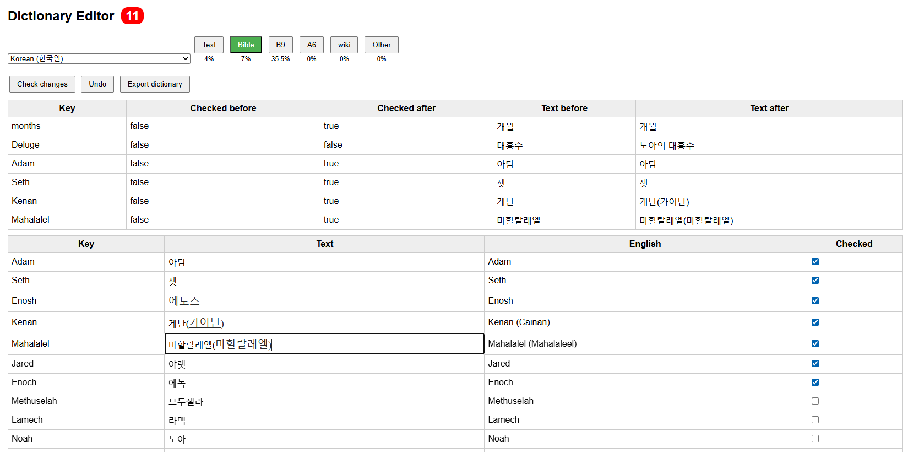

# Dictionary helper

Crowdsourced translation editor UI backed by GitHub PR automation. There are two main goals for this repository

## Web UI helper to translate the [timeline](https://github.com/kreier/timeline)

For the translations it's best if a native speaker has a last view over the translation to confirm it is correct. Excel files and Google sheets are one solution. But what about if you could just check it on your phone? So I created a UI that creates a pull request. I manage the backend and data structure and consistency. The users just click a few buttons, enter the name and hit "Submit". An early edition looks like this:

It's not yet mobile ready. Working on it ...

## Helper script to automate translation

The Google translate API works well for a first draft in translating the timeline into more than 200 languages. With context awareness the translations from LLMs like ChatGPT, Claude and Gemini got much better. But you don't have a simple API that you can call. The usual requests use the web interface. 

The helper scripts should create requests that can be copy/pasted into these agents, and then their answer be parsed and integrated to the csv database.

Another helper creates a pull request to the timeline project with the updated translations.
